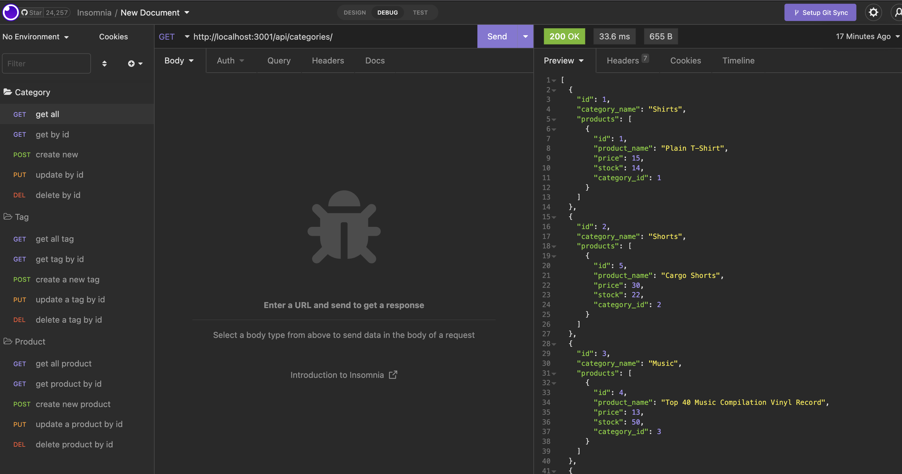
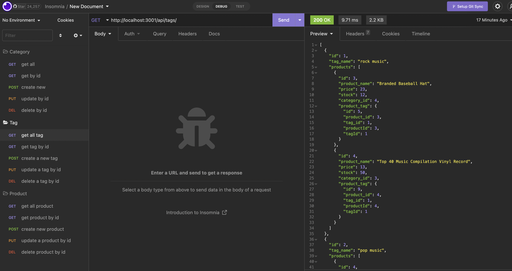
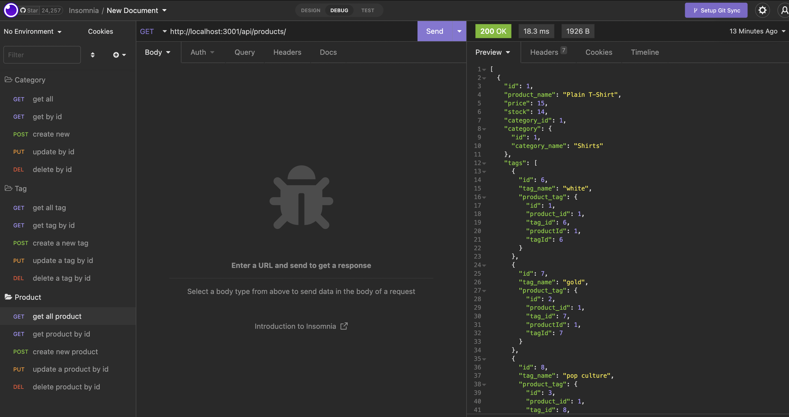

# E-CommerceBackEnd

## Description

This project is creating an E-Commerce backend API by using express.js Server and Sequelize ORM

## Table of Contents

- [Installation](#installation)
- [Usage](#usage)
- [Credits](#credits)
- [License](#license)
- [Tests](#tests)

## Installation

1. run command: npm install
2. login to mysql server and source the schema.sql
3. run command: npm run seed (to seed initial DB data)
4. add .env file in project root directory to configure database credential

## Usage

1. Go to project directory and run command: npm start

2. use API testing software(e.g. Insomnia) to access the backend API
   we can perform CRUD operation on Category Table
   

3. We can perform CRUD operation on Tag Table
   

4. We can perform CRUD operation on Product Table
   

Please refer to the video demo from below URL:

https://youtu.be/JrBXEqMTQRg

## Credits

BenLiu104 : https://github.com/BenLiu104

## License

License - MIT

## Tests

Use Insomnia to test the API functionality.
